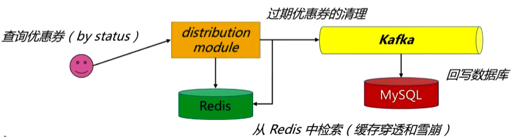
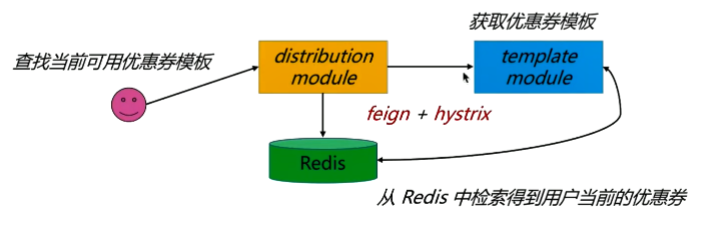
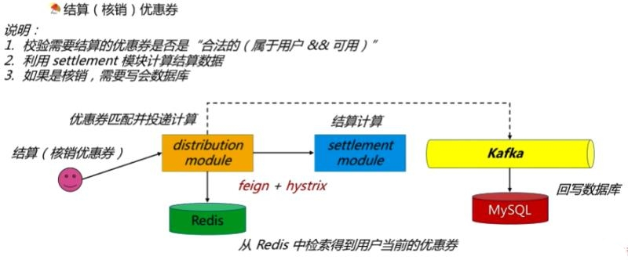

# Coupon - 优惠券微服务系统
优惠券系统/SpringCloud/kafka/redis

### 一、优惠券模板生成系统（template module）
- 根据运营人员设定的条件构造优惠券模板

生成优惠券的核心思想是：异步+优惠券码

本系统优惠券设计共18位满足两个要求：不可以重复、有一定的识别性

优惠券码：产品线+类型（前四位）+ 日期随机（中间六位） + 0-9随机数（后八位）

Q1：优惠券码是在一个服务实例中生成，生成指定数量的优惠券后放到Redis(list)中，这样做的目的如下：
```

1. 简单的解决优惠券码的一致性问题

2. 不会造成优惠券的超发

3. 不需要考虑分发优惠券时的配额问题
```

- 优惠券的清理

优惠券的模板规定有使用的期限，有两种过期的策略：
```
1. 优惠券模板自己的定期清理策略（使用redis expire）

2. 其它模块获取优惠券后自己校验是否过期（由于策略1存在延迟）

```

### 二、优惠券分发系统(distribution module)



1. 优惠券模板从template中获取（由于每个微服务独立运行，为了避免template微服务失效，使用熔断兜底策略）
2. 根据优惠券的领取限制，对比当前用户所拥有的优惠券，做出判断




### 三、优惠券结算系统（settlement module）

注意：结算和核销的区别

1. 结算：根据优惠券计算最后的将要付款的总额，该步骤主要涉及查询数据库。
2. 核销：依据结算的结果，当用户付款成功后，将实际的结果写回数据库，由于写回数据库是一个比较耗时的操作，这里通过kafka将结果异步的写回数据库。

